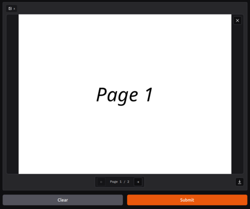

# gradio_tiff

[](https://pypi.org/project/gradio_tiff/)

A custom [Gradio](https://gradio.app) component that displays multi-page TIFF images.



## Install

```bash
pip install gradio_tiff
```

## Quick start

```python
import gradio as gr
from gradio_tiff import Tiff


def echo(path: str | None) -> str | None:
    return path


demo = gr.Interface(
    fn=echo,
    inputs=Tiff(value=Tiff().example_value(), label="Upload TIFF"),
    outputs=Tiff(label="Echoed TIFF"),
)

if __name__ == "__main__":
    demo.launch()
```

The component:

- accepts `.tif` / `.tiff` uploads (single file),
- renders each page as a PNG canvas and shows page navigation if the file is multi-page,
- exposes the local file path to your Python function via `preprocess`,
- packages a return value (path or URL) as a `FileData` payload via `postprocess`,
- emits `upload`, `change` and `clear` events.

## API reference

See [DOCS.md](DOCS.md) for the full auto-generated reference.
